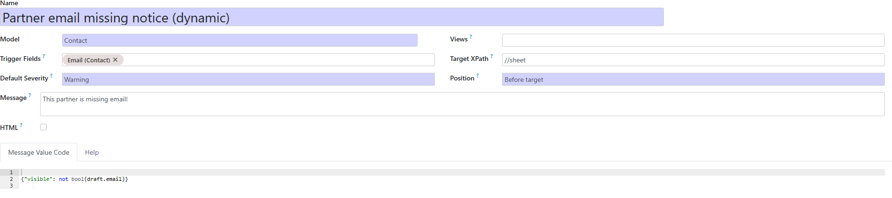
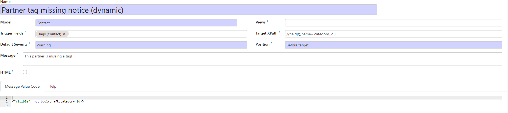
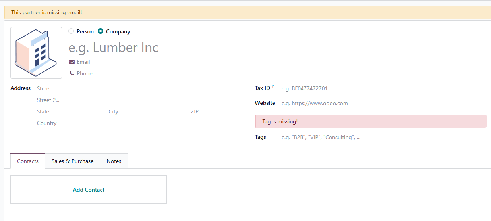
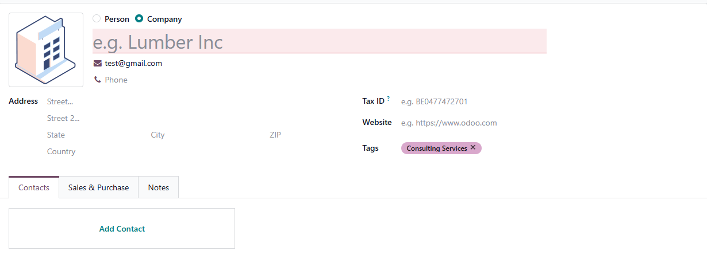

1.  Go to *Settings \> Technical \> User Interface \> Form Banner Rules*
    and create a rule.
2.  Choose Model, select Trigger Fields (optional), set Default
    Severity, select Views (optional), update Target XPath (insertion
    point) and Position, and configure the message.
3.  Save. Open any matching form record—the banner will appear and
    auto-refresh after load/save/reload.

## Usage of message fields:

- **Message** (message): Text shown in the banner. Supports
  \${placeholders} filled from values returned by message_value_code.
  Ignored if message_value_code returns an html value.
- **HTML** (message_is_html): If enabled, the message string is rendered
  as HTML; otherwise it's treated as plain text.
- **Message Value Code** (message_value_code): Safe Python expression
  evaluated per record. Return a dict such as {"visible": True,
  "severity": "warning", "values": {"name": record.name}}. Use either
  message or html (from this code), not both. Several evaluation context
  variables are available.

## Evaluation context variables available in Message Value Code:

- \`env\`: Odoo environment for ORM access.
- \`user\`: Current user (env.user).
- \`ctx\`: Copy of the current context (dict(env.context)).
- \`record\`: Current record (the form's record).
- \`draft\`: The persisted field values of the ORM record (before
  applying the current form's unsaved changes) + the current unsaved
  changes on trigger fields. Should be used instead of record when your
  rule is triggered dynamically by an update to a trigger field. It
  doesn't include any values from complex fields (one2many/reference,
  etc).
- \`record_id\`: Integer id of the record being edited, or False if the
  form is creating a new record.
- \`model\`: Shortcut to the current model (env\[record.\_name\]).
- \`url_for(obj): Helper that returns a backend form URL for \`obj.
- \`context_today(ts=None)\`: User-timezone “today” (date) for reliable
  date comparisons.
- time, \`datetime\`: Standard Python time/datetime modules.
- \`dateutil\`: { "parser": dateutil.parser, "relativedelta":
  dateutil.relativedelta }
- \`timezone\`: pytz.timezone for TZ handling.
- float_compare, float_is_zero, \`float_round\`: Odoo float utils for
  precision-safe comparisons/rounding.

All of the above are injected by the module to the safe_eval locals.

## Trigger Fields

*Trigger Fields* is an optional list of model fields that, when changed
in the open form, cause the banner to **recompute live**. If left empty,
the banner does **not** auto-refresh as the user edits the form.

When a trigger fires, the module sends the current draft values to the
server, sanitizes them, builds an evaluation record, and re-runs your
message_value_code.

You should use draft instead of record to access the current form values
if your rule is triggered based on an update to a trigger field.

## Message setting examples:

**A) Missing email on contact (warning)**

- Model: res.partner
- Message: This contact has no email.
- Message Value Code:

``` python
{"visible": not bool(record.email)}
```

**B) Show partner comment if available**

- Model: purchase.order
- Message: Vendor Comments: \${comment}
- Message Value Code (single expression):

``` python
{
  "visible": bool(record.partner_id.comment),
  "values": {"comment": record.partner_id.comment},
}
```

It is also possible to use "convenience placeholders" without an
explicit values key:

``` python
{
  "visible": bool(record.partner_id.comment),
  "comment": record.partner_id.comment,
}
```

**C) High-value sale order (dynamic severity)**

- Model: sale.order
- Message: High-value order: \${amount_total}
- Message Value Code:

``` python
{
  "visible": record.amount_total >= 30000,
  "severity": "danger" if record.amount_total >= 100000 else "warning",
  "values": {"amount_total": record.amount_total},
}
```

**D) Quotation past validity date**

- Model: sale.order
- Message: This quotation is past its validity date (\${validity_date}).
- Message Value Code:

``` python
{
  "visible": bool(record.validity_date and context_today() > record.validity_date and record.state in ["draft", "sent"]),
  "values": {"validity_date": record.validity_date},
}
```

**E) Pending activities on a task (uses \`env\`)**

- Model: project.task
- Message: There are \${cnt} pending activities.
- Message Value Code (multi-line with result):

``` python
cnt = env["mail.activity"].search_count([("res_model","=",record._name),("res_id","=",record.id)])
result = {"visible": cnt > 0, "values": {"cnt": cnt}}
```

**F) Product is missing internal reference (uses trigger fields)**

- Model: product.template
- Trigger Fields: default_code
- Message: Make sure to set an internal reference!
- Message Value Code:

``` python
{"visible": not bool(draft.default_code)}
```

**G) HTML banner linking to the customer's last sales order (uses
trigger fields)**

- Model: sale.order
- Trigger Fields: partner_id
- Message: (leave blank; html provided by Message Value Code)
- Message Value Code (multi-line with result):

``` python
domain = [("partner_id", "=", draft.partner_id.id)]
if record_id:
  domain += [("id", "<", record_id)]
last = model.search(domain, order="date_order desc, id desc", limit=1)
if last:
  html = "<strong>Previous order:</strong> <a href='%s'>%s</a>" % (url_for(last), last.name)
  result = {"visible": True, "html": html}
else:
  result = {"visible": False}
```

If we set up the rules for a partner record as shown below:





The banners will be displayed in the partner form view:



Once the values are filled in, the banners will disappear:


